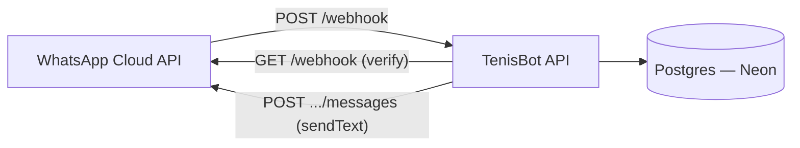

# Overview

- The only external integration today is the WhatsApp Cloud API, used by
  [WhatsApp messaging](/features/whatsapp-messaging.md) for both the
  webhook (inbound) and the Graph API (outbound replies).
- The database is Neon (serverless Postgres), reached over TLS via the
  singleton pool in `packages/api/src/config/db.ts` — see
  [the connection convention](../conventions/config/db-connection.md).
  The connection is live but unused — no feature reads or writes to it
  yet. See [Database schema](/db-schema.md).
- There is a `packages/web` package in the monorepo but it currently holds
  only a static `test.html` — no frontend feature exists to document yet.

# Update policy

When a new feature adds an external integration, a new inbound/outbound
edge, or starts using the database, update the diagram and the bullet list
above in the same commit.
